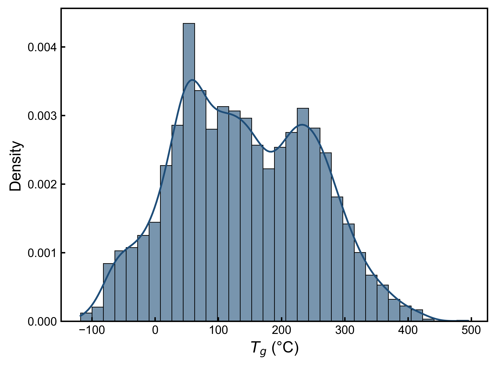
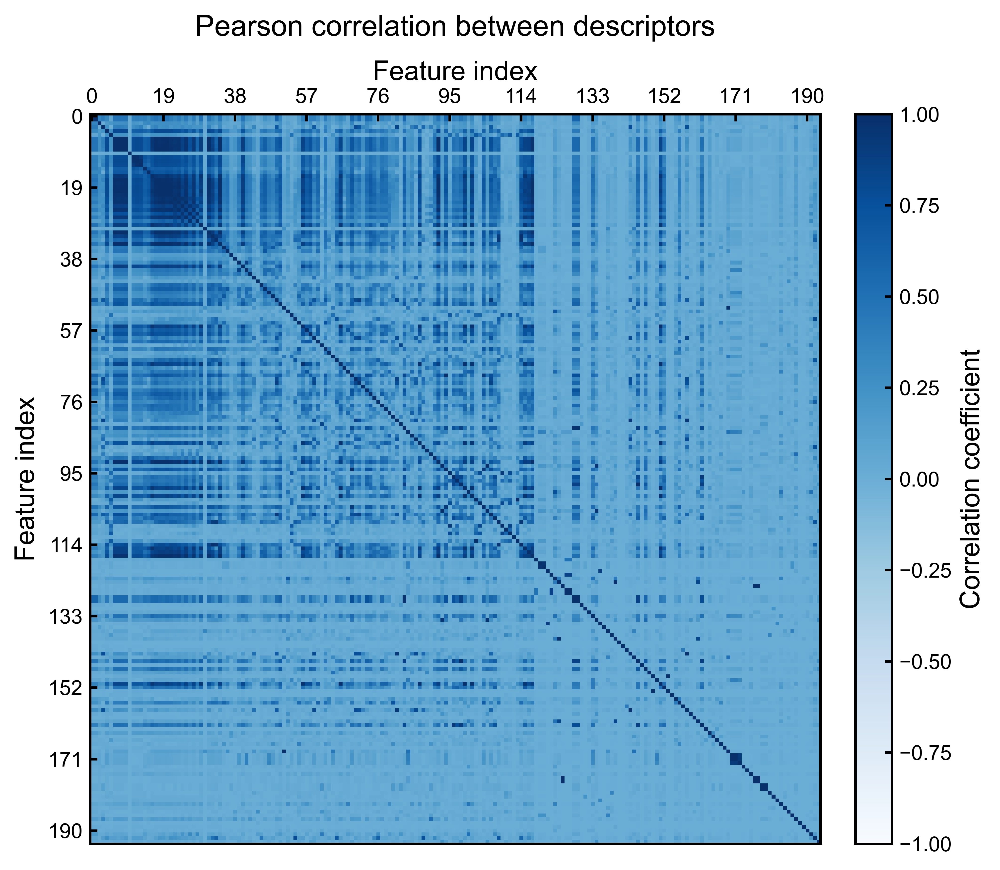
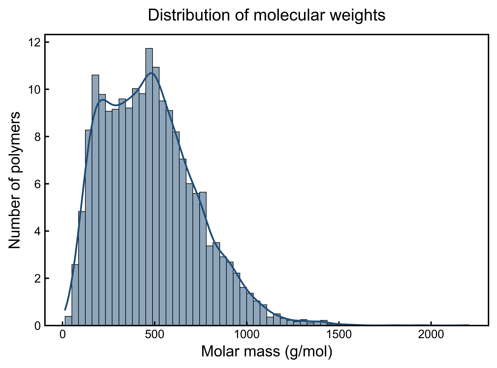

# Polymer-Informatics
This repository provides four Jupyter notebooks forming a structured learning module on polymer informatics and machine-learning workflows for polymer science. The material progresses from core concepts to predictive modeling, representation analysis, and generative design strategies.

## Notebooks
**01_polymer_ml_foundation.ipynb**  
Foundational introduction to polymer informatics, molecular representation, and feature engineering.

  
   
   Fig 1. Distribution of polymer glass-transition tempeature (Tg) showing dataset coverage and density. 

  
   
   Fig 2. Pearson correlation matrix of molecular descriptors higlighting redundancy and feature dependence. 

  
   
   Fig 3. Distribution of molecular weights of repeating units. 

**02_polymer_prediction.ipynb**  
Polymer property prediction using supervised learning models and evaluation protocols.

**03_polymer_feature_space_exploration.ipynb** 
Construction of virtual polymers from small-molecule datasets and polymerization rules, followed by feature-space analysis using dimensionality reduction (t-SNE), clustering, and explainable ML (SHAP).

**04_polymer_inverse_design_generation.ipynb**  
Generative and inverse-design approaches for creating hypothetical polymers using reinforcement-learning-driven optimization.
